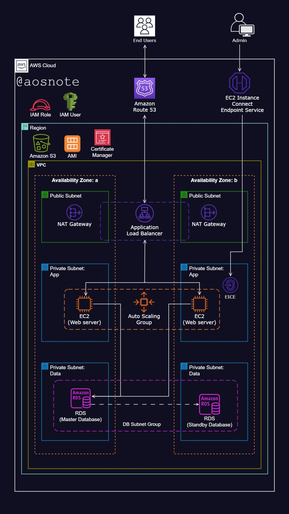

**Dynamic eCommerce Website Deployment on AWS**

This repository contains scripts and configuration files to deploy a dynamic eCommerce website on Amazon Web Services (AWS). Below is an overview of the architecture and services utilized in this deployment.

### Architecture Overview

The deployment is based on a microservices architecture, leveraging various AWS services for scalability, reliability, and security

### Services Utilized

- **Virtual Private Cloud (VPC)**: Configured with public and private subnets spanning two availability zones for enhanced availability and fault tolerance.
- **Internet Gateway**: Enables connectivity between VPC instances and the wider internet.
- **Security Groups**: Acts as a network firewall mechanism to control traffic to and from instances.
- **Availability Zones**: Utilized for increased system reliability and fault tolerance.
- **Public Subnets**: Host infrastructure components like the NAT Gateway and Application Load Balancer.
- **EC2 Instance Connect Endpoint**: Facilitates secure connections to assets within both public and private subnets.
- **Identity and Access Management (IAM)**: Used to create roles allowing EC2 instances to access and communicate with data files stored in S3.
- **Amazon Relational Database Service (RDS)**: Provides database service for the application.
- **Private Subnets**: Hosts web servers (EC2 instances) and databases (RDS instances) for enhanced security.
- **NAT Gateway**: Allows instances in private subnets to access the internet.
- **Application Load Balancer (ALB)**: Distributes web traffic evenly to an Auto Scaling Group of EC2 instances across multiple Availability Zones.
- **Auto Scaling Group**: Automatically manages EC2 instances for availability, scalability, fault tolerance, and elasticity.
- **Certificate Manager**: Secures application communications.
- **Simple Notification Service (SNS)**: Configured to alert about activities within the Auto Scaling Group.
- **Route 53**: Registers the domain name and sets up DNS records.
- **Amazon S3**: Stores application code and migration SQL scripts.

### Deployment Script

```bash
#!/bin/bash

S3_URI=s3://sjo-sql-files/V1__shopwise.sql
RDS_ENDPOINT=dev-db.cjcqgoksfnmb.us-east-1.rds.amazonaws.com
RDS_DB_NAME=applicationdb
RDS_DB_USERNAME=admin
RDS_DB_PASSWORD=admin123

# Update all packages
sudo yum update -y

# Download and extract Flyway
sudo wget -qO- https://download.red-gate.com/maven/release/com/redgate/flyway/flyway-commandline/10.9.1/flyway-commandline-10.9.1-linux-x64.tar.gz | tar -xvz 

# Create a symbolic link to make Flyway accessible globally
sudo ln -s $(pwd)/flyway-10.9.1/flyway /usr/local/bin

# Create the SQL directory for migrations
sudo mkdir sql

# Download the migration SQL script from AWS S3
sudo aws s3 cp "$S3_URI" sql/

# Run Flyway migration
flyway -url=jdbc:mysql://"$RDS_ENDPOINT":3306/"$RDS_DB_NAME" \
  -user="$RDS_DB_USERNAME" \
  -password="$RDS_DB_PASSWORD" \
  -locations=filesystem:sql \
  migrate
```

### Instructions for Deployment

1. Clone this repository to your local machine.
2. Configure your AWS credentials and ensure necessary permissions.
3. Customize the deployment script with your specific configurations, such as S3 URI, RDS endpoint, database name, username, and password.
4. Execute the deployment script on your EC2 instance.

### Note

- Ensure proper security configurations and permissions are applied to all resources for a secure deployment.
- Regularly monitor and optimize the deployed resources for performance and cost efficiency.

For more detailed information, refer to the documentation and comments within the deployment scripts and configuration files.

**Author**: Sunday Okpala


